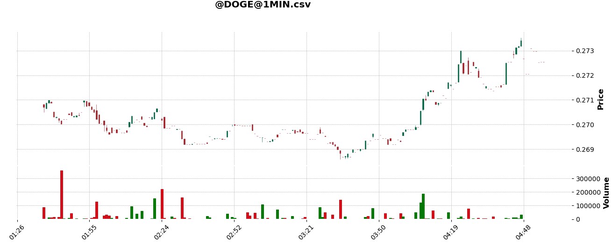

## CLI
This guide will show you all the features of the command line interface that comes with Harvest. To get started type:

```bash
python -m harvest -h
```

This will output the following:

```bash
usage: -m [-h] {start,visualize} ...

Harvest CLI

positional arguments:
  {start,visualize}

optional arguments:
  -h, --help         show this help message and exit
```

Here you can see that the cli requires one of two arguments `start` and `visualize`. Each argument is described below.

## start

The `start` argument is used to run Harvest. Here you can specify your storage, streamer, broker, and which algorithms you want to run. To get started type:

```bash
python -m harvest start -h
```

This will output the following:

```bash
usage: -m start [-h] [-o {memory,csv,pickle,db}] [-s {dummy,yahoo,polygon,robinhood,alpaca,kraken,webull}] [-b {paper,robinhood,alpaca,kraken,webull}] [-d DIRECTORY] [--debug | --no-debug]

optional arguments:
  -h, --help            show this help message and exit
  -o {memory,csv,pickle,db}, --storage {memory,csv,pickle,db}
                        the way to store asset data
  -s {dummy,yahoo,polygon,robinhood,alpaca,kraken,webull}, --streamer {dummy,yahoo,polygon,robinhood,alpaca,kraken,webull}
                        fetches asset data
  -b {paper,robinhood,alpaca,kraken,webull}, --broker {paper,robinhood,alpaca,kraken,webull}
                        buys and sells assets on your behalf
  -d DIRECTORY, --directory DIRECTORY
                        directory where algorithms are located
  --debug, --no-debug
```

The first option is the storage which is specified with the `-o` flag. The default is `memory` which stores asset data only in memory.

The second option is the streamer which is specified with the `-s` flag. The default is `dummy` which generates random data and not based on asset data at all. All other streamers fetch data from actual data sources.

The third option is the broker which is specified with the `-b` flag. The default is `paper` which is Harvest's internal paper trader. 

The fourth option is the directory which is specified with the `-d` flag. The default is the current working directory. All files in the given directory will be searched, and if a file has an algorithm it will be run by Harvest. A file with an algorithm has to be a python file with a class that inherits from the `BaseAlgo` class. If `HARVEST_SKIP` is found anywhere on the first line of the file, it will be skipped. This is a good way to ignore algorithms that you don't want to run.

The fifth option is a boolean option which can be either `--debug` or `--no-debug`. The default is `--no-debug` which informs the Harvest logger not to print debugging messages. Turn this option on if you want more details as to what Harvest is doing.

### Examples

Run Harvest without saving asset data to disk, simulate assets, use Harvest paper trader, look for algorithms in the current working directory, and do not show debugging logs.

```bash
python -m harvest start 
```

Run Harvest with asset data saved as csv files, fetch data from polygon, use alpaca to handle trading, run the algorithms found in the `algos` folder, and show debugging information.

```bash
python -m harvest start -o csv -s polygon -b alpaca -d ./algos --debug
```

## visualize

The `visualize` argument is used view stored OHLC data that Harvest stores. It expects either a csv or pickle file. It is also dependent on the [mplfinance](https://pypi.org/project/mplfinance/) python package which is not installed by default with Harvest. To get started run:

```bash
python -m harvest visualize -h
```

This will output the following:

```bash
usage: -m visualize [-h] path

positional arguments:
  path        path to harvest generated data file

optional arguments:
  -h, --help  show this help message and exit
```

As you can see this is a very simple command. The only argument is the path to the csv or pickle file. This path can be relative or absolute.

### Example

```bash
python -m visualize ./storage/@DOGE@1MIN.csv
```

Output to terminal:

```bash
@DOGE at 1MIN
open    0.2708127
high    0.27352659999999995
low     0.2685754
close   0.27254029999999996
price change    0.0017275999999999403
price change percentage 0.004209551475752374%
volume  3486334.8061624
```

Output graph:

